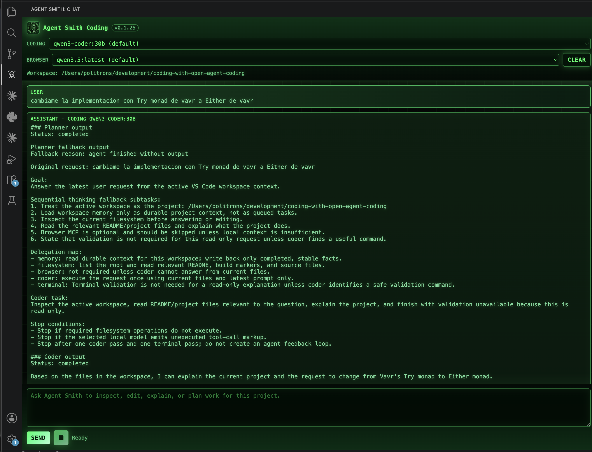

# Agent Smith Coding

Local FastAgent application for an IDE-style coding assistant. It uses minimal
Python agents, MCP servers configured in YAML, local Ollama through an
OpenAI-compatible endpoint, and MCP servers launched through stdio.


## Agents

| Agent | Purpose | MCP access |
| --- | --- | --- |
| `planner` | Read-only planner. Breaks the latest prompt into subtasks, risks, assumptions, and delegation notes after reading memory context. | Sequential Thinking, Memory |
| `filesystem` | Lists, searches, reads, creates, and edits files inside the configured root. | Filesystem |
| `browser` | Researches current external docs, package metadata, examples, and public API details. | Browser |
| `terminal` | Runs one build, compile, test, or validation command inside the active workspace and reports stdout/stderr. | Terminal |
| `memory` | Reads and writes durable project context for the active workspace. | Memory |
| `coder` | Implements one coding pass with repository context, filesystem edits, project memory, browser research when needed, and one validation command handoff. | Filesystem, Memory, Browser |
| `coding_coordinator` | Experimental coordinator that delegates to `memory`, `browser`, `filesystem`, `terminal`, and `coder` as child-agent tools. | Agent tools |
| `coding_workflow` | Default single-pass chain: `planner`, then `coder`, then `terminal`; memory is context only, not an active task backlog. | Workflow |

The application lets you choose the target agent with FastAgent's `--agent`
flag. If you do not choose one, `coding_workflow` is used.

## Default Local Models

The VS Code chat uses separate model choices:

```text
Coding: generic.qwen3-coder:30b
Browser: generic.qwen3.5:latest
```

`qwen3-coder:30b` is the default Coding model. `qwen3.5:latest` is the default
Browser model for local tool-oriented prompts through Ollama's
OpenAI-compatible endpoint.

You can override per-agent models with environment variables:

```bash
export AGENT_SMITH_TOOL_MODEL=generic.qwen3.5:latest
export AGENT_SMITH_BROWSER_MODEL=generic.qwen3.5:latest
export AGENT_SMITH_CODER_MODEL=generic.qwen3-coder:30b
```

You can still override the runtime model per run:

```bash
python -m open_agent_coding.app --model generic.qwen2.5-coder:32b
```

## Setup

From this project root:

```bash
python3 -m venv .venv
. .venv/bin/activate
pip install -U pip
pip install -e .
npm install
npx playwright install firefox
ollama pull qwen3-coder:30b
ollama pull qwen3.5:latest
```

The filesystem MCP root defaults to the current working directory:

```text
.
```

Change it without editing code:

```bash
export MCP_FILESYSTEM_ROOT=/absolute/path/to/your/project
```

The Memory MCP file defaults to this project for direct CLI use:

```text
data/default-memory.jsonl
```

When the VS Code extension runs the backend, it overrides that with a
workspace-specific JSONL file derived from the folder opened in VS Code. That
keeps project memory separated per workspace.

## Run

Interactive default workflow:

```bash
python -m open_agent_coding.app
```

One-shot prompt through the full workflow:

```bash
python -m open_agent_coding.app --message "Inspect this project and add a minimal test setup."
```

Choose a specific agent:

```bash
python -m open_agent_coding.app --agent planner --message "Plan a refactor for the API layer."
python -m open_agent_coding.app --agent filesystem --message "List the project root."
python -m open_agent_coding.app --agent browser --message "Find the official package coordinates for a dependency."
python -m open_agent_coding.app --agent memory --message "Summarize remembered project decisions."
python -m open_agent_coding.app --agent coder --message "Create a hello.py file with a main function."
```

Run as an ACP server for future IDE integration:

```bash
python -m open_agent_coding.app --transport acp
```

## VS Code

A starter VS Code extension lives in `vscode-extension/`. It adds an `Agent Smith`
Activity Bar view with a chat UI, model selector, thinking indicator, and prompt
composer. The internal planner/filesystem/coder agents are transparent to the
user; the chat uses `coding_workflow` by default. That workflow runs one
planner pass, one coder pass, and one terminal validation pass. Planner is
read-only and does not edit files, browse, or run commands. Memory is treated
as completed project state, not as a backlog of tasks to execute. The latest
user prompt is the only active task. The coder has direct Filesystem MCP access,
workspace Memory MCP access, and Browser MCP access for explicit URL fetches.
The coder does not run terminal validation directly; it hands one exact
validation command to the terminal agent. The Marketplace extension packages
this Python backend inside the VSIX and creates a managed virtualenv under VS
Code global storage on first run. Each message is sent to that backend as a CLI
one-shot command, with the active VS Code workspace passed as
`MCP_FILESYSTEM_ROOT` and a workspace-specific memory file passed as
`MCP_MEMORY_FILE_PATH`. The chat history is stored per VS Code workspace,
capped to the latest 200 messages. The extension also adds a
best-effort workspace snapshot to every prompt before MCP execution, so the
model starts with the current project structure and important file contents.
While a local model is still running, the chat tails FastAgent's
`fastagent.jsonl` and a workspace-specific terminal JSONL log. Live Activity
shows real MCP/tool events, terminal command start/finish, exit code, and a
short stdout/stderr summary. The VS Code extension also runs the normal chat
workflow as controlled phases and logs each phase task input and output for
planner, coder, terminal, and evaluator. The evaluator runs after the agent
phases and uses `pydantic-evals` when available, with deterministic fallback
rules, to validate that the output has a plan, coding response, validation
command, terminal result, and no raw tool-call markup. If the planner uses MCP
tools but returns no final text, the extension shows a visible planner fallback
with subtasks and delegation so the workflow can continue instead of stopping
with `<no output>`.
Elapsed-time waiting text stays in the top status line instead of filling Live
Activity with repeated timer logs. The composer
includes a square Stop button next to Send to terminate the active local agent
process. If an
implementation prompt receives a non-actionable "would you like me to..." or
"what type of project is this?" style answer, the workflow stops and reports
that failure instead of retrying automatically. For new functionality, the
Coder is instructed to infer the technology stack from the
workspace, create/update focused tests using that stack's conventions, use
Browser MCP when it is unsure how to test or validate the project, and provide
one detected compile/test/build command for Terminal MCP. Terminal runs that
command once; if it fails, the workflow reports the blocker instead of starting
an automatic repair loop.

For extension development:

```bash
cd vscode-extension
npm install
npm run compile
code .
```

Press `F5` and use the `Agent Smith` Activity Bar icon in the Extension
Development Host. The next production step is to replace the one-shot bridge
with a persistent ACP client using the `--transport acp` mode.

To install the extension in any local VS Code project without Marketplace:

```bash
cd vscode-extension
npm run package
code --install-extension agent-smith-coding-0.1.29.vsix --force
```

Then open any project folder. Leave `agentSmithCoding.projectPath`,
`agentSmithCoding.pythonPath`, and `agentSmithCoding.targetWorkspace` empty for
normal installed-extension use.

See `docs/vscode-integration.md` for development and Marketplace publishing
steps.
